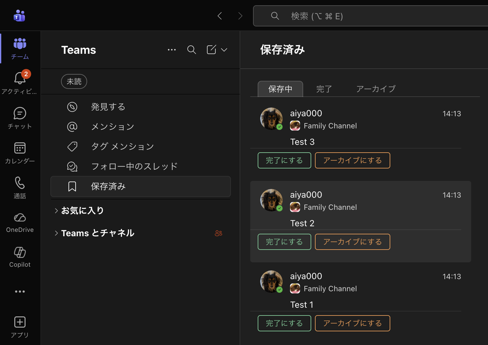
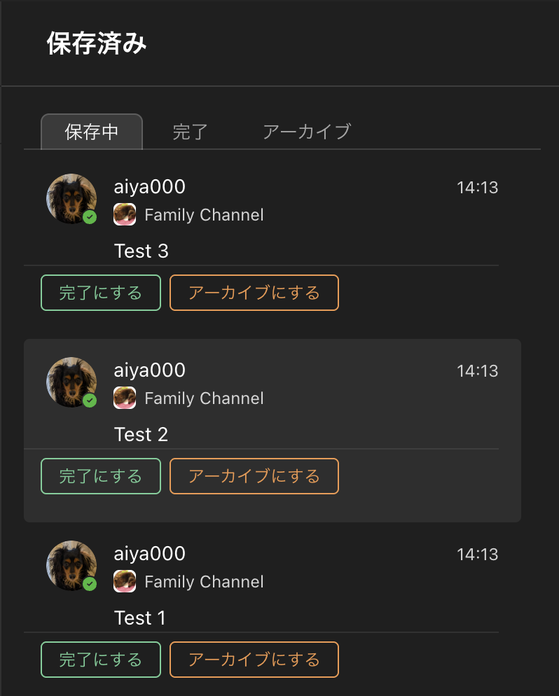
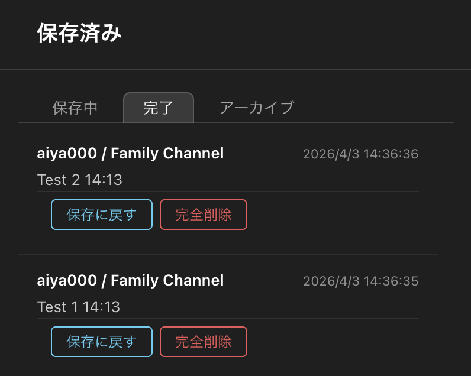
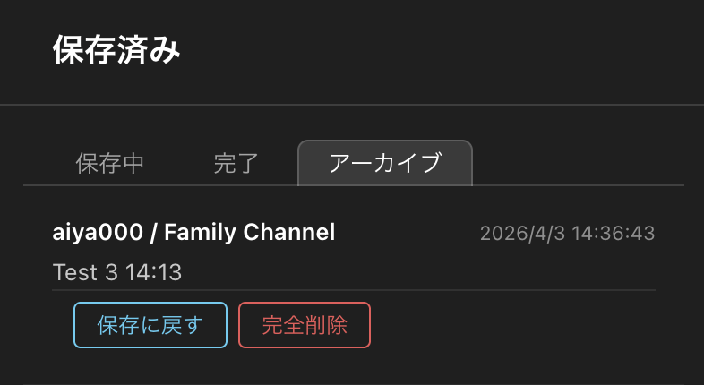

# Teams Saved Extensions - Slack-style "Done" and "Archive"

Adds Slack-style "Completed" and "Archived" tabs to the "Saved" section in Microsoft Teams.  
You can organize items saved in "Saved" by categorizing them into "Completed" or "Archived," or by deleting them. Data is stored in localStorage.

> **Note:** The author only uses Teams in Japanese, so only the Japanese version of Teams is currently supported. PRs are welcome! :D

## 機能

**保存中タブ** — Teams ネイティブの保存済みリストを表示。各メッセージに「完了にする」「アーカイブにする」ボタンを追加。

**完了タブ** — 完了にしたメッセージの一覧。カードをクリックすると元のメッセージへジャンプ。

**アーカイブタブ** — アーカイブにしたメッセージの一覧。

**その他**

- 「保存に戻す」で保存中タブに戻せる（Teams 側の保存済みはそのまま残る）
- 「完全削除」で一覧から削除（確認ダイアログあり）
- エクスポート / インポートで JSON ファイルにデータを保存・復元
- データは `localStorage` に保存（クラウド同期なし）

## インストール

1. ブラウザに [Tampermonkey](https://www.tampermonkey.net/) をインストール
2. [teams-saved-extension.user.js](https://raw.githubusercontent.com/aiya000/tampermonkey-teams-saved-extension/refs/heads/main/teams-saved-extension.user.js) を Tampermonkey にインストール

## 対応 URL

- `https://teams.microsoft.com/*`
- `https://teams.live.com/*`
- `https://teams.cloud.microsoft/*`
